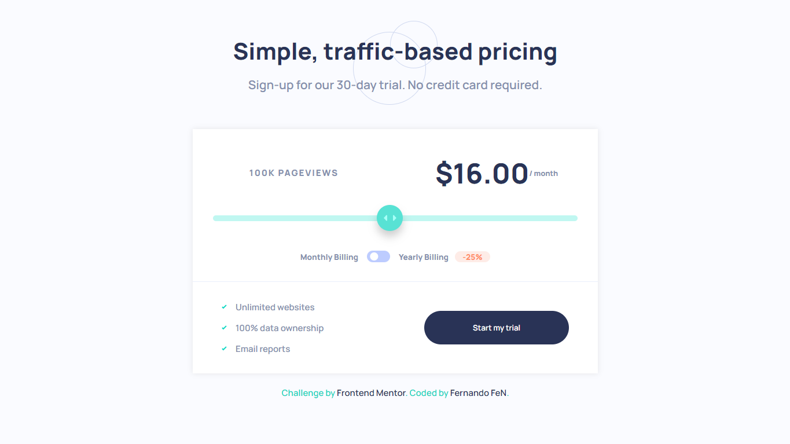

# Frontend Mentor - Interactive pricing component solution

This is a solution to the [Interactive pricing component challenge on Frontend Mentor](https://www.frontendmentor.io/challenges/interactive-pricing-component-t0m8PIyY8). Frontend Mentor challenges help you improve your coding skills by building realistic projects. 

### The challenge

Users should be able to:

- View the optimal layout for the app depending on their device's screen size
- See hover states for all interactive elements on the page
- Use the slider and toggle to see prices for different page view numbers

### Screenshot

### Links

- Solution URL: [My Solution](https://your-solution-url.com)
- Live Site URL: [My Live Site](https://your-live-site-url.com)

### Built with

- Semantic HTML5 markup
- SCSS custom properties
- Flexbox
- Grid
- Mobile-first workflow

## Author

- Website - [FernandoFeN](https://fernando0654.github.io/Portafolio-React/)
- Frontend Mentor - [@Fernando0654](https://www.frontendmentor.io/profile/Fernando0654)
